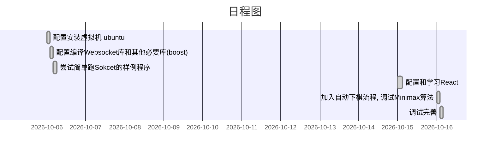

# 井字棋的人机交互

xupengbo, 2021.10.16

## 项目要求
+ 前端 React
+ 后端 C++
+  通信 Websocket

## 项目思路
    由于在初步了解React时,入门教程就是做一个井字棋,在此基础上想到: 做一个用户在前端使用先手下子,将棋盘状态通过Websocket协议传到后端，后端收到棋盘状态后通过极大极小(Minimax)算法返回收益最大的下字的新棋盘, 再传给前端, 其中需要注意前端的实时渲染。
## 目录解释

+ README.md

- my-app
  - src
    - index.css
    - index.js
  - ...其他文件，此处不再上传
  - build 为项目打包,前端只需运行build部分即可

- websocketpp_server
  - CMakeLists.txt
  - main.cpp

## 项目组成

+ 前端 React App, 作为client

index.js要点
```js
//点击棋盘格子时的回调函数
handleClick(i){
    const squares=this.state.squares.slice();//棋盘格子数组
	const OnState=this.state.On_Off;//开启关闭状态
	const Steps=this.state.GameStep;//步数
	
	if(!OnState){
	    return;
	}
        if (calculateWinner(squares) || squares[i]) {    
            //如果已经存在胜者，或该格子已被占用，则无效  
            return; 
        }
        if(Steps===9){//步数已够
            return; 
        }
        squares[i] = this.state.xIsNext ? 'X' : 'O';
	if(Steps===8){//第九步下完也没有了
	  this.setState({
            squares:squares,
            xIsNext:!this.state.xIsNext,
	    GameStep:Steps+1
            }
	  );
	}
	else{
        //需要向后端发送棋盘信息，并接收新棋盘信息
	  client.send(JSON.stringify({
   		username: this.state.xIsNext,
   		content: squares
 		}));
	  let curNext=true;
	  client.onmessage = event => {
    		console.log(event.data);
		let newDataJson= JSON.parse(event.data);
		curNext=newDataJson["username"];
		let newsquares=newDataJson["content"];
		for(let i=0;i<9;++i){
		    squares[i]=newsquares[i];
		}
	  }
      //更新棋盘
      this.setState({
            squares:squares,
            xIsNext:curNext,
	    GameStep:Steps+2
            }
	   );
	}
}

```
另外为了实现实时的渲染刷新，需要加入下面函数

```js
componentDidMount() {
	this.timerID = setInterval(
	  () => this.tick(),
      	  100//定时器为100ms
	);
    }
   tick() {
	this.setState({
        squares:this.state.squares,
        });
   }
```


+ 后端 
    - 用到Websocketpp库，nlohmann json
    - 作为server

main.cpp 要点
```cpp
class utility_server {
public:
    utility_server() {
        m_endpoint.set_reuse_addr(true);
        // Set logging settings
        m_endpoint.set_error_channels(websocketpp::log::elevel::all);
        m_endpoint.set_access_channels(websocketpp::log::alevel::all ^ websocketpp::log::alevel::frame_payload);
        // Initialize Asio
        m_endpoint.init_asio();
        // Register our message handler
        m_endpoint.set_message_handler(std::bind(
                &utility_server::echo_handler, this,
                std::placeholders::_1, std::placeholders::_2
        ));
    }
    /*
    *中间部分为Minimax算法的实现，这里不再解释
    */
    void echo_handler(websocketpp::connection_hdl hdl, server::message_ptr msg) {
        std::cout << "收到"
                  << ", message: " << msg->get_payload()
                  << std::endl;
        board = json::parse(msg->get_payload());

        if (msg->get_payload() == "stop-listening") {
            m_endpoint.stop_listening();
            return;
        }
        handleGame();//这里会将收益最大的下法更新到json对象board里
        //发送时需要将json转化为string格式
        try {
            msg->set_payload(to_string(board));
            m_endpoint.send(hdl, msg->get_payload() , msg->get_opcode());
        } catch (websocketpp::exception const & e) {
            std::cout << "Echo failed because: "
                      << "(" << e.what() << ")" << std::endl;
        }
    }
    void run() {
        try{
            // Listen on port 9002
            m_endpoint.listen(9001);
            // Queues a connection accept operation
            m_endpoint.start_accept();
            // Start the Asio io_service run loop
            m_endpoint.run();
        }
        catch (websocketpp::exception const & e) {
            std::cout << e.what() << std::endl;
        }
        catch (...) {
            std::cout << "other exception" << std::endl;
        }
    }
    //...//
private:
    server m_endpoint;//服务器对象
    json board; //棋盘状态
    char A[3][3];//使用char数组方便计算
};
```

日程图

> 由于同时参加、准备其他公司的笔试或面试,所以时间比较分散



## 演示

X:用户,O:机器，以用户输给机器为例:


